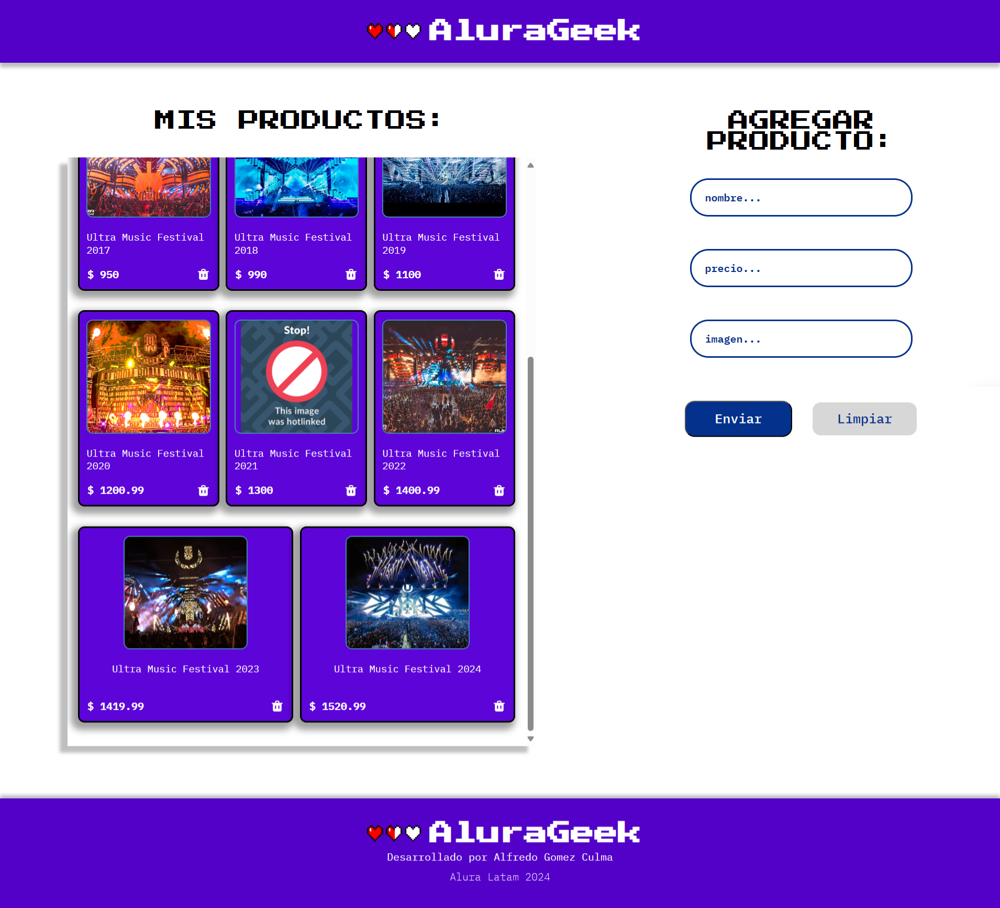
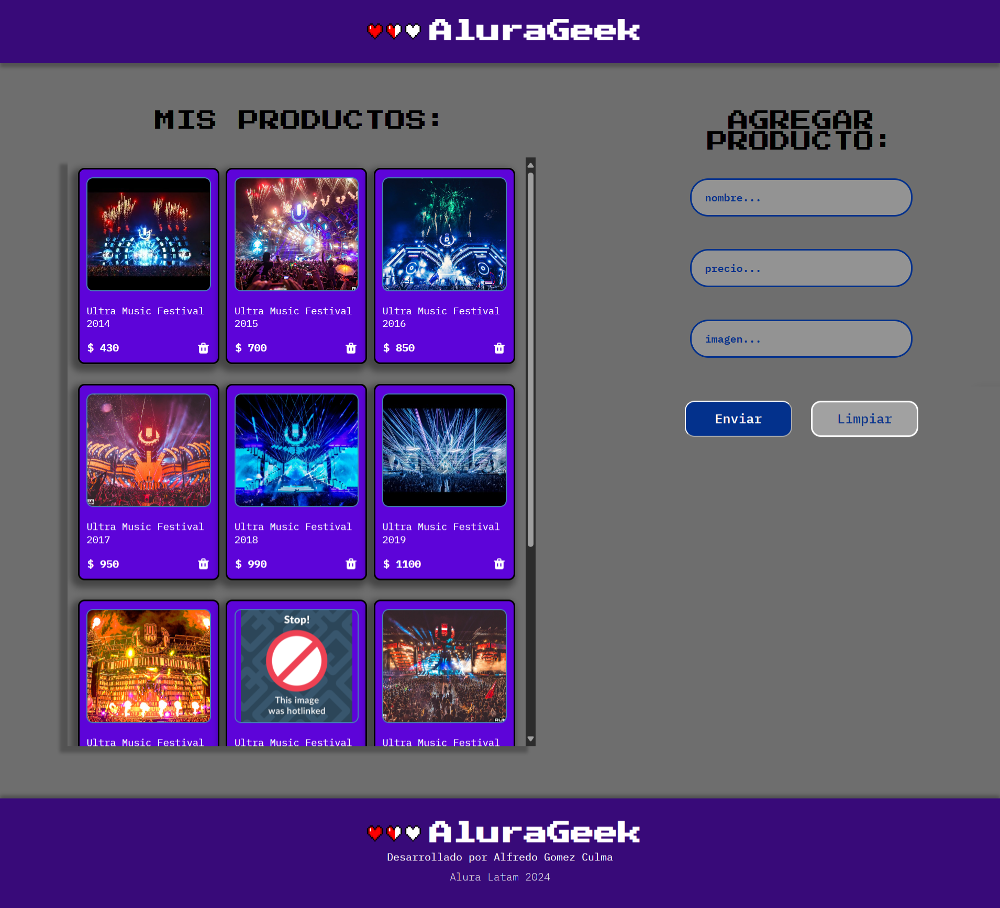

# Desafío Alurageek

Este proyecto es parte de la formación Front-end del programa Alura ONE (Oracle Next Education). Consiste en desarrollar una página web (Alurageek) que muestra productos obtenidos de un servidor utilizando fetch GET, permite agregar nuevos productos mediante fetch POST y eliminar productos mediante fetch DELETE.

## Funcionalidades

- Visualización de los productos desde un servidor local.
- Agregado de nuevos productos a la lista.
- Eliminación de productos existentes.

## Instalación

1. Clona este repositorio en tu máquina local.

      git clone URL_DEL_REPOSITORIO

2. Instalación de Node.js:

- Ve al sitio web oficial de Node.js:

<https://www.nodejs.org>

- Descarga la versión recomendada (LTS) para tu sistema operativo.
- Ejecuta el instalador y sigue las instrucciones del instalador.

4. Instalación de json-server:

- Abre una terminal.
- Instala json-server globalmente utilizando npm:

      npm install json-server

5. Iniciar el servidor JSON:

- En la misma terminal, ve al directorio donde clonaste el repositorio.
- Ejecuta el siguiente comando para poner en marcha el servidor en el puerto 3002:

      npx json-server --watch db.json --port 3002

6. Debe tener la extensión Live Server instalada en Visual Studio Code para poder visualizar la página web. Si no la tienes, puedes instalarla desde el siguiente enlace:

<https://marketplace.visualstudio.com/items?itemName=ritwickdey.LiveServer>

7. Accede a la página:

- Una vez que el servidor esté activo, abre la página utilizando Live Server a través de la URL: <http://127.0.0.1:5501/>
- Para acceder directamente a los datos del servidor JSON, utiliza la URL: <http://localhost:3002/productos>

7. Si todo ha funcionado correctamente, deberías ver una página similar a esta con los productos ya visibles:

*La primera imagen muestra la página en modo claro.*

*La segunda imagen muestra la página en modo oscuro.*
